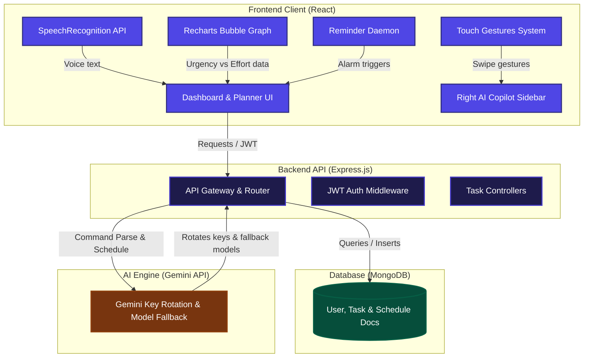
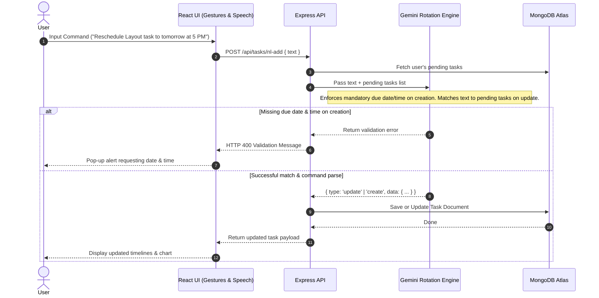

# ⚡ TASKping (TaskPilot AI) ⚡

<p align="center">
  <a href="https://blockseblock.com/hackathon_details/Vibe2Ship" target="_blank">
    
  </a>
   <a href="https://taskping-104u.onrender.com" target="_blank">
    
  </a>
   <a href="https://nodejs.org/en">
    
  </a>
   <a href="https://aistudio.google.com/api-keys">
    
  </a>
</p>

---

## 🚀 About the Project
**TASKping** is a premium MERN-stack task scheduler and proactive reminder application built as a flagship submission for the **Vibe2Ship Hackathon**. It shifts the burden of task planning from the user to a server-side Gemini intelligence loop. 

Unlike traditional static checklists, TASKping parses natural language (or speech dictation) to schedule or edit tasks, checks date/time parameters dynamically, ranks task urgency, maps daily timelines to peak focus energy windows, and visually plots tasks on an interactive Urgency vs. Effort grid.

---

## 🗺️ System Architecture



---

## 🔄 AI Command & Scheduling Workflow



---

## ✨ Features

- 👤 **Custom JWT Authentication**: Secure user login and registration with hashed password cookies.
- 🔄 **Gemini API Key Rotation**: Automatically toggles between `GEMINI_KEY_1` and `GEMINI_KEY_2` when encountering quota limits (`429 Too Many Requests`), or prioritizes the user's custom API key.
- ⚡ **Energy-Aware Scheduling**: Dynamically schedules heavy-effort tasks during your peak energy window (Morning, Afternoon, or Evening Focus).
- 🎙️ **Speech-to-Text Input**: Dictate tasks directly using browser-native `SpeechRecognition` API.
- 📉 **Priority Score & Click Focus**: Plots pending tasks on an Urgency vs. Effort grid using a responsive Recharts scatter-bubble layout. Clicking any point focuses and displays complete task details, schedule start, and deadline below.
- ⚙️ **Task Editing Modals & commands**: Edit tasks manually via form modals or by speaking/writing commands to the AI.
- 🚨 **Proactive Reminder system**: Alarm manager checks schedules every 15 seconds. Reminds users 2 hours, 1 hour, and 30 minutes before task time, automatically backing off reminders based on remaining time (e.g. every 2 minutes for imminent tasks).
- 📱 **Swipeable Right AI Sidebar**: Sidebar displaying workspace health and today's schedule. Swipe left from the right edge of the screen to open; swipe right to close.
- 🛡️ **Android Chrome Fallback**: Handles browser notification TypeErrors gracefully by falling back to Service Worker notification builders.

---

## 🛠️ Local Development

### 1. Configure Environments
Create `backend/.env` in the backend folder:
```env
PORT=5000
MONGO_URI=your_mongodb_connection_uri
JWT_SECRET=your_jwt_signing_secret
GEMINI_KEY_1=your_primary_gemini_api_key
GEMINI_KEY_2=your_fallback_gemini_api_key
```

### 2. Install dependencies
```bash
npm run install-all
```

### 3. Run Development Servers
```bash
npm run dev
```

---

## 🚀 Unified Render Deployment

TASKping is fully optimized for **Render Blueprints**, bundling the backend API and static frontend assets under a single unified web service.

1. Push your code to your GitHub fork (`nomaantalib/TASKPing`).
2. Go to your [Render Dashboard](https://dashboard.render.com).
3. Click **New +** ➔ **Blueprint**.
4. Link your repository.
5. Render will read `render.yaml` and automatically deploy your application on their Free Tier, prompting you for credentials during setup.
